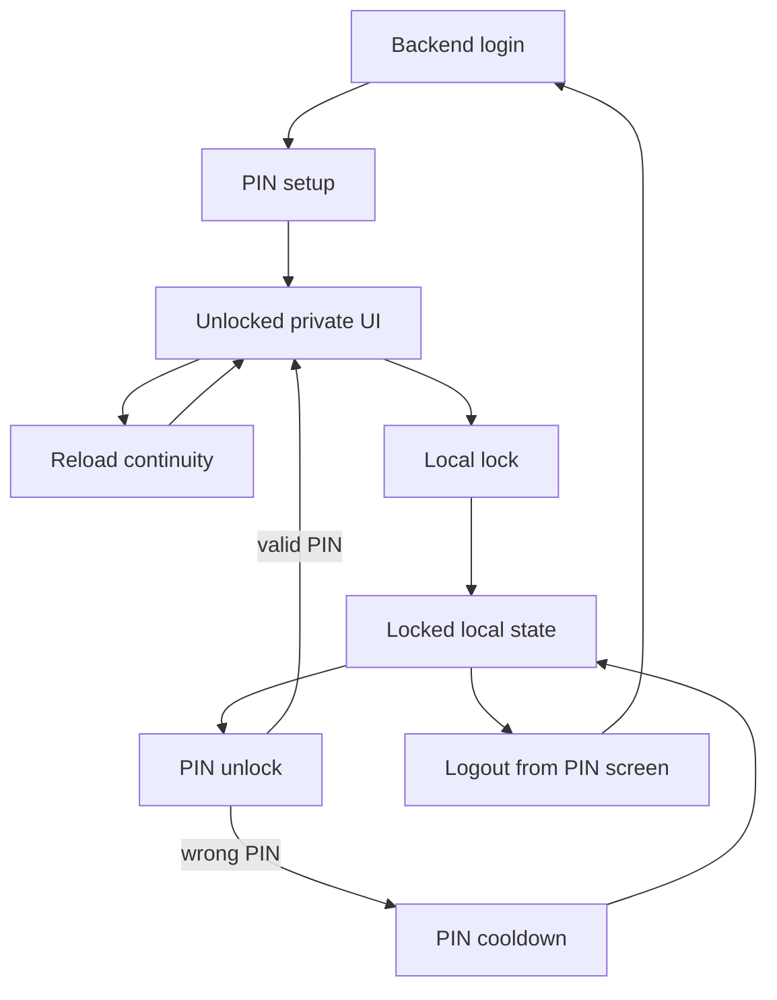

[Russian](./security_RU.md)

# Security: PIN and secure storage

This document describes how local PIN protection, encrypted frontend cache, and browser storage work now.

## Purpose

The PIN is a local unlock layer for data that the frontend stores in the browser. It does not replace backend authentication, server-side session revocation, OS-level device protection, or protection against DevTools/XSS/full control of the browser profile.

The main goal is simple: when the app is locally locked, sensitive cached data must not be readable by the UI until the user unlocks it with the PIN.

## Current flow



## Flow details

`Backend login` proves the user to the server and creates the normal backend session. It also marks that this browser profile must finish local PIN setup before private routes can render.

`PIN setup` is a local browser step: the user enters and confirms the PIN, the app derives a PIN key, creates the master key, stores the encrypted key material, and clears the setup mark. No backend request is required here.

`Locked local state` means sensitive local data is unavailable to the app. The encrypted cache can stay in IndexedDB, but there is no usable master key in memory, and query restoration/API requests are gated.

`PIN unlock` decrypts the stored master key with the PIN-derived key. A valid PIN opens secure storage; a wrong PIN updates local lockout state and can move the app into cooldown. The PIN screen also offers an explicit logout action, so the user is not forced to remember the PIN to remove their data from this browser.

`Unlocked private UI` is the only state where encrypted frontend data can be decrypted and rendered. React Query can restore encrypted cache only after security state is ready and the master key is available.

`Reload continuity` keeps the app unlocked across page refreshes until the 6-hour deadline by restoring a non-extractable session `CryptoKey`. This is convenient, but still a same-origin browser capability, so it is removed on lock or deadline expiry.

`Local lock` happens on inactivity, the absolute 6-hour deadline, local cleanup, or a cross-tab lock event. It removes runtime key access, clears plaintext query memory, cancels active queries, and keeps only encrypted persisted data.

`Logout from PIN screen` uses the same local-auth-block resolution as PIN setup integrity failures. The app first tries to terminate the current backend session, then clears all local application data. When server logout succeeds, the local block marker is cleared and the login screen opens. When the browser is offline or the request fails, local data is still cleared and a local-auth-block marker is stored; the app retries server logout when connectivity returns.

`PIN cooldown` is a best-effort browser-local delay after repeated wrong PIN entries. It improves normal-device protection but is not tamper-proof against DevTools or full browser control.

## Key hierarchy

```text
PIN
  -> PBKDF2 + salt
  -> KEK
  -> decrypts encrypted master key
  -> AES-GCM master key
  -> encrypts persisted frontend data
```

The raw master key is not stored in `localStorage`, `sessionStorage`, or JS-readable cookies. Reload continuity uses a non-extractable browser `CryptoKey`, not exported raw key bytes.

## Storage map

| Storage                      | Key / pattern                              | Contains                                          | Why it exists                                                         | Protection / cleanup                                                                                       |
| ---------------------------- | ------------------------------------------ | ------------------------------------------------- | --------------------------------------------------------------------- | ---------------------------------------------------------------------------------------------------------- |
| IndexedDB via `idb-keyval`   | `viatrade_query_cache`                     | Persisted TanStack Query cache                    | Keeps backend data available between reloads                          | Encrypted through `secureQueryPersister`; not read while locked; plaintext query memory is cleared on lock |
| IndexedDB via `idb-keyval`   | `viatrade_security_salt`                   | PBKDF2 salt                                       | Required to derive the PIN key consistently                           | Plaintext; salt is not secret                                                                              |
| IndexedDB via `idb-keyval`   | `viatrade_security_encrypted_master_key`   | AES-GCM master key encrypted by PIN-derived KEK   | Lets the app unlock encrypted local data after PIN entry              | Stored only encrypted; unusable without the correct PIN-derived key                                        |
| IndexedDB via `idb-keyval`   | `viatrade_security_master_key_iv`          | IV for encrypted master key                       | Required for AES-GCM decrypt of the encrypted master key              | Plaintext; not secret, but tied to the encrypted master key                                                |
| IndexedDB via `idb-keyval`   | `viatrade_security_session_master_key`     | Non-extractable session `CryptoKey`               | Allows reload without asking for PIN again before the 6-hour deadline | Removed on lock, deadline expiry, and local data clear                                                     |
| IndexedDB via `idb-keyval`   | `viatrade_security_last_unlock_at`         | Last successful unlock timestamp                  | Tracks when the current unlock session started                        | Plain metadata; used only for local lock timing                                                            |
| IndexedDB via `idb-keyval`   | `viatrade_security_unlock_deadline_at`     | Absolute unlock deadline timestamp                | Enforces the 6-hour maximum unlocked lifetime                         | Plain metadata; checked on bootstrap, timers, focus/resume                                                 |
| IndexedDB via `idb-keyval`   | `viatrade_security_pin_lockout_state`      | Failed attempts, lockout level, cooldown deadline | Implements escalating PIN cooldown                                    | Plain best-effort metadata; reset after successful PIN; not tamper-proof                                   |
| IndexedDB via `idb-keyval`   | `viatrade_security_pin_setup_mark`         | Local marker that PIN setup is required           | Prevents private UI access after login until local PIN is created     | Plain best-effort marker; cleared after successful setup                                                   |
| IndexedDB via secure storage | `viatrade_notes_personal`                  | Personal local notes                              | Notes are user data and can be sensitive                              | Encrypted after unlock; legacy plaintext `localStorage` value is migrated and removed                      |
| IndexedDB via secure storage | `viatrade_reminds_drafts_<remindId>`       | Reminder draft text/date/time                     | Drafts are local user data                                            | Encrypted after unlock; legacy plaintext `localStorage` value is migrated and removed                      |
| localStorage                 | `mantine-color-scheme-value`               | Theme preference                                  | UI preference only                                                    | Plaintext is acceptable; not cleared as sensitive data                                                     |
| localStorage                 | `viatrade_layout_desktop_sidebar_expanded` | Sidebar preference                                | UI preference only                                                    | Plaintext is acceptable                                                                                    |
| JavaScript cookies           | Any non-HttpOnly app cookies               | JS-readable cookie data                           | May exist for non-auth local behavior                                 | Cleared by local data clear; not used for raw master key storage                                           |
| HttpOnly cookies             | Backend auth cookies                       | Server-owned auth/session state                   | Backend authentication                                                | Frontend JS cannot read or delete them; true logout requires an online backend call                        |
| CacheStorage / PWA cache     | App shell assets                           | Static JS/CSS/HTML/fonts                          | Lets the app shell load offline                                       | Should not contain user API responses                                                                      |

## Lock behavior

The app locks in these cases:

- 15 minutes of user inactivity;
- 6 hours after the last successful PIN unlock;
- explicit local lock or local data cleanup;
- cross-tab lock event from another tab.

On lock:

- memory master key is cleared;
- persisted session `CryptoKey` is removed;
- active queries are cancelled;
- plaintext React Query memory is cleared;
- encrypted persisted cache remains stored;
- UI preferences remain untouched.

Tabs synchronize lock and deadline updates through `BroadcastChannel`.

## PIN lockout

After every 3 wrong PIN entries, the app starts an escalating cooldown:

| Failed PIN block | Cooldown   |
| ---------------- | ---------- |
| 1st block        | 2 minutes  |
| 2nd block        | 5 minutes  |
| 3rd block        | 30 minutes |
| 4th block        | 2 hours    |
| 5th block        | 6 hours    |
| 6th block        | 12 hours   |
| 7th+ block       | 24 hours   |

A successful PIN unlock resets the failed-attempt state.

This is browser-local best-effort protection. A user with DevTools can edit IndexedDB, change time, patch runtime state, or replace the bundle. Tamper-proof lockout requires backend enforcement, WebAuthn/platform-backed storage, or a native wrapper with OS secure storage.

## Network and logout rules

- While PIN locked, the API request gate blocks domain requests and refresh retry.
- Auth entry and exit requests are handled separately. The PIN-locked screen exposes an explicit logout action that follows the local-auth-block flow.
- When online, the action ends the current backend session and clears all local application data before opening the login screen.
- When offline or when the logout request fails, the frontend clears local data and stores the local-auth-block marker. It cannot delete `Secure; HttpOnly` backend cookies and must not claim that the server session was revoked; it retries the backend logout when connectivity returns.

## What this does not protect against

- DevTools or full control of the browser runtime.
- XSS or malicious extensions running JavaScript in this origin.
- Modified browser storage, modified bundle, modified clock, or compromised OS.
- Data already visible in an unlocked UI.
- Offline server logout when auth is stored in HttpOnly cookies.
