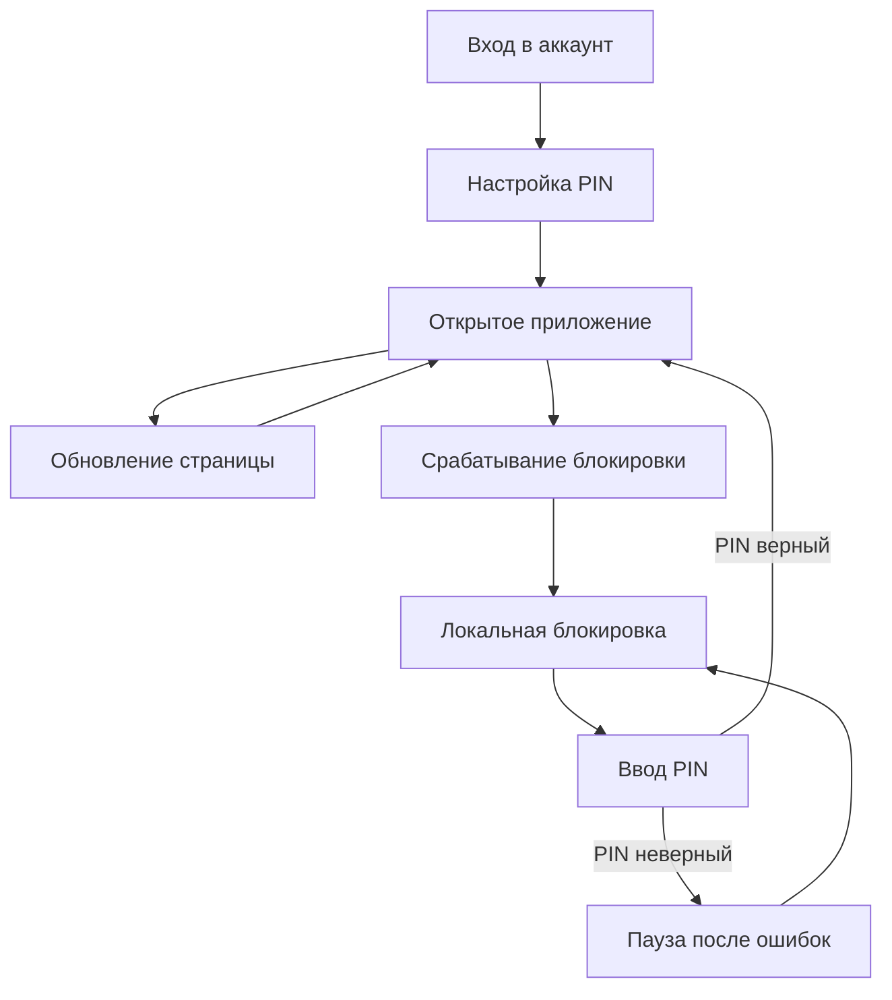

[English](./security.md)

# Безопасность: PIN и защищенное хранилище

Документ кратко описывает, как сейчас устроены локальный PIN-код, шифрование кеша и хранение данных в браузере.

## Зачем нужен PIN

PIN-код защищает данные, которые фронтенд уже сохранил в браузере пользователя. Это дополнительная локальная защита, а не замена серверной авторизации.

PIN не отзывает серверную сессию, не удаляет серверные cookies и не защищает от пользователя, который полностью контролирует браузер через DevTools, расширения или измененный код приложения.

Главная задача PIN-кода: пока приложение заблокировано, оно не должно читать и показывать чувствительные локальные данные.

## Общая схема



## Что происходит на этапах

`Вход в аккаунт` - пользователь проходит обычную серверную авторизацию. После этого приложение ставит локальную отметку, что в этом браузере нужно настроить PIN перед показом приватных страниц.

`Настройка PIN` - полностью локальный шаг. Пользователь вводит PIN и подтверждает его. Приложение создает ключи шифрования и сохраняет их в браузере так, чтобы без PIN нельзя было открыть зашифрованные локальные данные. Запрос к серверу на этом этапе не нужен.

`Локальная блокировка` - состояние, в котором приложение не может расшифровать чувствительный кеш. Зашифрованные данные могут оставаться в IndexedDB, но ключа для чтения в памяти нет.

`Ввод PIN` - приложение пробует восстановить ключ шифрования из сохраненных данных и введенного PIN. Если PIN верный, защищенное хранилище становится доступно. Если PIN неверный, обновляется счетчик ошибок.

`Открытое приложение` - единственное состояние, где можно читать зашифрованный кеш и показывать приватные данные. В этом состоянии React Query может восстановить сохраненный кеш.

`Обновление страницы` - если 6-часовой срок разблокировки еще не истек, приложение восстанавливает локальную сессию без повторного PIN. Для этого хранится специальный браузерный `CryptoKey`, который нельзя экспортировать как обычные байты.

`Срабатывание блокировки` - происходит после 15 минут бездействия, через 6 часов после последнего верного PIN, при локальной очистке данных или по событию из другой вкладки. Приложение удаляет ключ из памяти, чистит открытый кеш React Query и оставляет только зашифрованные данные.

`Пауза после ошибок` - локальная задержка после нескольких неверных PIN. Она защищает от обычного подбора на оставленном устройстве, но не является надежной защитой от DevTools.

## Иерархия ключей

```text
PIN
  -> PBKDF2 + salt
  -> ключ, полученный из PIN
  -> расшифровывает master key
  -> master key
  -> шифрует локальные данные приложения
```

Сам PIN не хранится и не отправляется на сервер. Исходный `master key` не хранится в `localStorage`, `sessionStorage` или обычных JavaScript cookies.

Для обновления страницы без повторного PIN используется `CryptoKey` из браузера. Это удобство для пользователя, но не абсолютная защита: код, который уже выполняется в том же origin, может использовать такой ключ, пока приложение разблокировано.

## Что хранится в браузере

| Где хранится                         | Ключ или шаблон                            | Что хранит                                            | Зачем нужно                                                                    | Как защищается или очищается                                                                       |
| ------------------------------------ | ------------------------------------------ | ----------------------------------------------------- | ------------------------------------------------------------------------------ | -------------------------------------------------------------------------------------------------- |
| IndexedDB через `idb-keyval`         | `viatrade_query_cache`                     | Сохраненный кеш TanStack Query                        | Чтобы не терять кеш backend-данных между перезагрузками страницы               | Хранится зашифрованным; не читается при блокировке; открытый кеш в памяти очищается при блокировке |
| IndexedDB через `idb-keyval`         | `viatrade_security_salt`                   | Salt для PBKDF2                                       | Нужен для стабильного получения ключа из PIN                                   | Хранится открыто; salt не является секретом                                                        |
| IndexedDB через `idb-keyval`         | `viatrade_security_encrypted_master_key`   | `master key`, зашифрованный ключом из PIN             | Позволяет восстановить доступ к локальным зашифрованным данным после ввода PIN | Хранится только в зашифрованном виде                                                               |
| IndexedDB через `idb-keyval`         | `viatrade_security_master_key_iv`          | IV для расшифровки `master key`                       | Нужен алгоритму AES-GCM                                                        | Хранится открыто; сам по себе не является секретом                                                 |
| IndexedDB через `idb-keyval`         | `viatrade_security_session_master_key`     | Неэкспортируемый `CryptoKey` текущей локальной сессии | Позволяет обновить страницу без повторного PIN до истечения 6 часов            | Удаляется при блокировке, истечении срока и локальной очистке данных                               |
| IndexedDB через `idb-keyval`         | `viatrade_security_last_unlock_at`         | Время последней успешной разблокировки                | Нужно для отсчета срока локальной сессии                                       | Открытая служебная метка                                                                           |
| IndexedDB через `idb-keyval`         | `viatrade_security_unlock_deadline_at`     | Время обязательной блокировки                         | Ограничивает разблокированное состояние 6 часами                               | Открытая служебная метка; проверяется при запуске, фокусе вкладки и таймерах                       |
| IndexedDB через `idb-keyval`         | `viatrade_security_pin_lockout_state`      | Ошибки PIN и срок паузы                               | Нужен для задержки после неверных PIN                                          | Открытое локальное состояние; сбрасывается после верного PIN; не считается защищенным от изменения |
| IndexedDB через `idb-keyval`         | `viatrade_security_pin_setup_mark`         | Отметка, что нужно настроить PIN                      | Не дает открыть приватные страницы сразу после login без локального PIN        | Открытая локальная отметка; удаляется после успешной настройки PIN                                 |
| IndexedDB через защищенное хранилище | `viatrade_notes_personal`                  | Личные заметки                                        | Это пользовательские данные, их нельзя оставлять открытым текстом              | Шифруются после разблокировки; старые данные из `localStorage` переносятся и удаляются             |
| IndexedDB через защищенное хранилище | `viatrade_reminds_drafts_<remindId>`       | Черновики напоминаний                                 | Это локальные пользовательские данные                                          | Шифруются после разблокировки; старые данные из `localStorage` переносятся и удаляются             |
| localStorage                         | `mantine-color-scheme-value`               | Тема интерфейса                                       | Это обычная настройка UI                                                       | Может храниться открыто                                                                            |
| localStorage                         | `viatrade_layout_desktop_sidebar_expanded` | Состояние бокового меню                               | Это обычная настройка UI                                                       | Может храниться открыто                                                                            |
| JavaScript cookies                   | Любые cookies, доступные из JS             | Неавторизационные локальные значения, если они есть   | Могут использоваться для обычного поведения приложения                         | Очищаются при локальной очистке данных; `master key` там не хранится                               |
| HttpOnly cookies                     | Серверные auth cookies                     | Серверная авторизация                                 | Нужны backend для сессии пользователя                                          | Frontend JS не может их прочитать или удалить; настоящий logout требует запроса на backend         |
| CacheStorage / PWA cache             | Файлы приложения                           | HTML, JS, CSS, шрифты                                 | Позволяет загрузить оболочку приложения без сети                               | Не должен хранить пользовательские ответы API                                                      |

## Когда приложение блокируется

Приложение переходит в локальную блокировку в нескольких случаях:

- пользователь бездействует 15 минут;
- прошло 6 часов после последнего верного PIN;
- пользователь или код приложения запускает локальную очистку;
- другая вкладка сообщает о блокировке через `BroadcastChannel`.

При блокировке приложение удаляет ключ из памяти, удаляет сохраненный ключ локальной сессии, отменяет активные запросы и очищает открытый кеш React Query. Зашифрованный кеш остается в IndexedDB, потому что без ключа его нельзя прочитать через обычный flow приложения.

## Неверные PIN и пауза

После каждых 3 неверных PIN включается задержка:

| Блок ошибок  | Задержка |
| ------------ | -------- |
| 1-й          | 2 минуты |
| 2-й          | 5 минут  |
| 3-й          | 30 минут |
| 4-й          | 2 часа   |
| 5-й          | 6 часов  |
| 6-й          | 12 часов |
| 7-й и дальше | 24 часа  |

После верного PIN счетчик ошибок сбрасывается.

Важно: это локальная защита. Человек с DevTools может изменить IndexedDB, время в системе или код приложения. Если нужна защита, которую нельзя обойти локально, ее нужно делать на backend, через WebAuthn или через нативное приложение с защищенным хранилищем ОС.

## Запросы и logout

Пока приложение заблокировано PIN-кодом, обычные доменные API-запросы и refresh retry блокируются. Это нужно, чтобы закрытое приложение не восстанавливало и не обновляло чувствительные данные в фоне.

Настоящий logout возможен только при наличии сети и успешном запросе к backend. Если пользователь offline, frontend может очистить локальные данные, но не может удалить `Secure; HttpOnly` cookies и не должен утверждать, что серверная сессия завершена.

## Ограничения

Эта схема не защищает от:

- DevTools и полного контроля браузера;
- XSS или вредоносного расширения, которое выполняет JavaScript в приложении;
- ручного изменения IndexedDB, localStorage, cookies, времени или bundle;
- данных, которые уже показаны в разблокированном интерфейсе;
- настоящего offline logout при авторизации через HttpOnly cookies.
